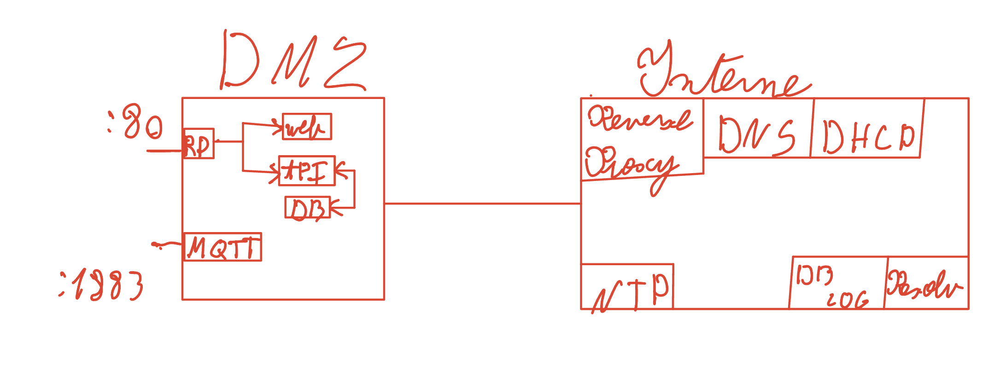

# 🛠️ SECTION ADMIN : Configuration LAN Interne

Cette section détaille la gestion de l'infrastructure critique située sur le serveur LAN.

## 1. Stack Services
L'infrastructure est orchestrée via `docker-compose.yaml` avec les services suivants :

| Service | Rôle | Port Interne |
| :--- | :--- | :--- |
| `bind_internal` | DNS (BIND9) | 53 (TCP/UDP) |
| `dhcp_interne` | Serveur DHCP | 67 (UDP) |
| `ntp_lan` | Serveur de temps | 123 (UDP) |
| `elasticsearch` | Stockage Logs | 9200 |
| `logstash` | Indexation Logs | 5044 |
| `kibana` | Dashboard Logs | 5601 |
| `filebeat_lan` | Collecteur Logs | - |
| `reverse_proxy` | Nginx (Proxy) | 80 |

## 2. DNS Interne (BIND9)
Le serveur gère la zone lan.interne.

- Fichiers de zone : ./bind/zones/db.lan.interne

## 3. DHCP ET NTP

Ces services utilisent le mode network_mode: host pour interagir directement avec les interfaces physiques de la machine hôte :

    - DHCP : Configuration dans ./dhcpd.conf.
    - NTP : Synchronisation via serveurs pool.ntp.org.

## 4. Architecture Réseau

Le serveur utilise une segmentation par réseaux Docker isolés pour garantir la sécurité et la stabilité :

    - logNet : Flux dédié exclusivement à la stack ELK.
    - lanDns : Flux pour la résolution de noms entre services.
    - host : Utilisé pour les services réseau bas niveau (DHCP/NTP).

## Schéma

