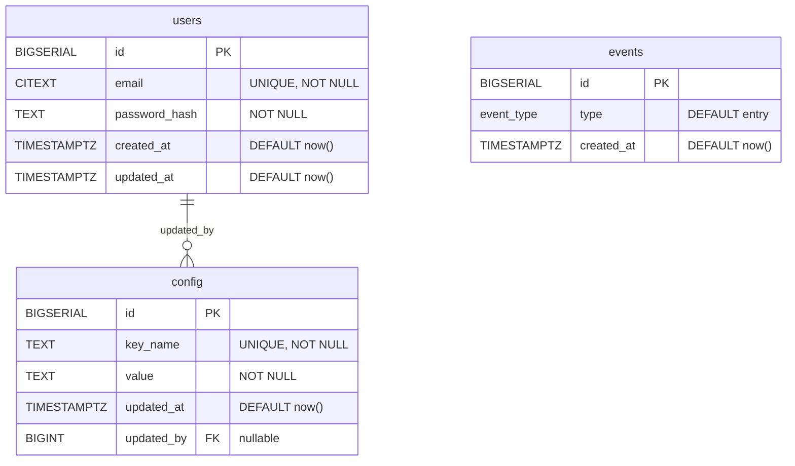

## ERD (US-1.1)

### Notes
- `events.type` est un enum PostgreSQL (`event_type`) et ne contient pour l’instant que `entry` (facile à étendre si besoin).
- `config.key_name` permet de stocker des paramètres comme `threshold` (seuil), `led_state`, etc.
- `config.updated_by` est optionnel et passe à `NULL` si l’utilisateur est supprimé.

